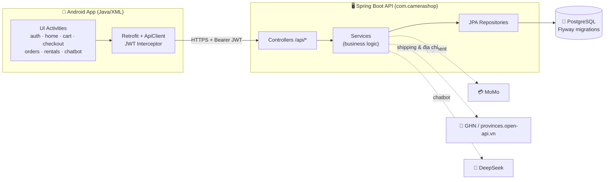
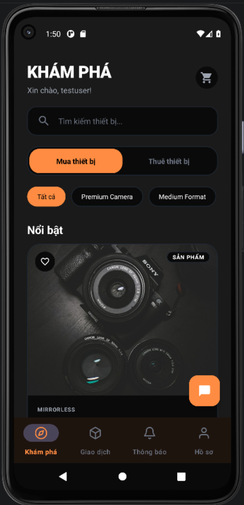
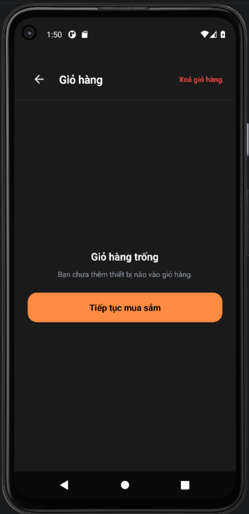
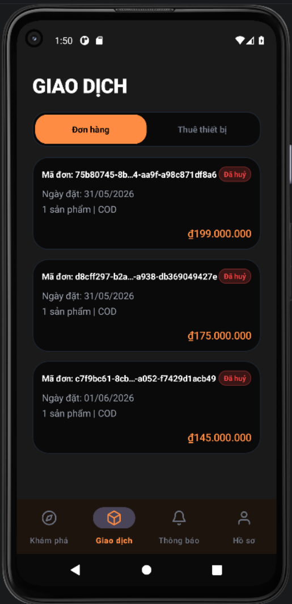
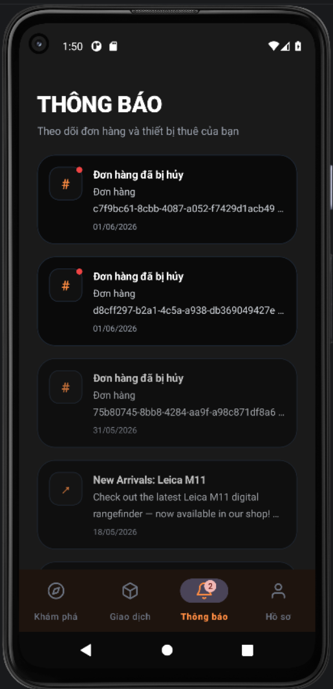
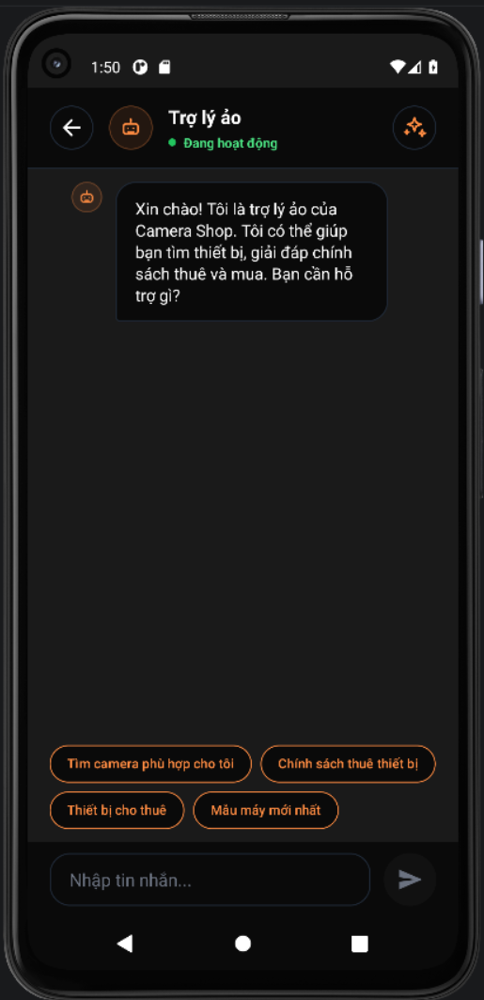
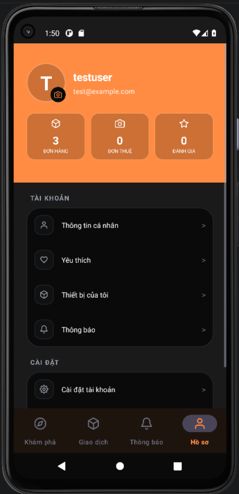

<div align="center">

# 📸 Lensora

### Chợ thiết bị máy ảnh — **Mua · Bán · Thuê** trên một ứng dụng duy nhất

*Nền tảng giúp người dùng mua sắm, ký gửi và thuê thiết bị nhiếp ảnh một cách nhanh chóng, an toàn và tiện lợi.*

<br/>

[](https://openjdk.org/)
[](https://spring.io/projects/spring-boot)
[](https://www.postgresql.org/)
[](https://developer.android.com/)
[](https://www.docker.com/)

[](#)
[](#)
[](#)
[](#)
[](#)

</div>

---

## 📑 Mục lục

- [🎯 Giới thiệu](#-giới-thiệu)
- [✨ Tính năng nổi bật](#-tính-năng-nổi-bật)
- [🏗️ Kiến trúc tổng quan](#️-kiến-trúc-tổng-quan)
- [🧰 Công nghệ sử dụng](#-công-nghệ-sử-dụng)
- [🖼️ Ảnh màn hình](#️-ảnh-màn-hình)
- [⚙️ Yêu cầu môi trường](#️-yêu-cầu-môi-trường)
- [🚀 Chạy Backend](#-chạy-backend)
- [📱 Chạy Frontend Android](#-chạy-frontend-android)
- [🔑 Tài khoản test](#-tài-khoản-test)
- [🔌 API chính](#-api-chính)
- [🔐 Cấu hình dịch vụ ngoài](#-cấu-hình-dịch-vụ-ngoài)
- [📂 Cấu trúc thư mục](#-cấu-trúc-thư-mục)

---

## 🎯 Giới thiệu

**Lensora** là một sàn thương mại điện tử chuyên biệt cho **thiết bị nhiếp ảnh** (máy ảnh, ống kính, phụ kiện…), hỗ trợ đồng thời ba mô hình giao dịch:

| 🛍️ **Mua** | 🏷️ **Bán / Ký gửi** | 📅 **Thuê** |
|:---:|:---:|:---:|
| Duyệt catalog, thêm giỏ hàng, thanh toán & giao hàng | Đăng bán thiết bị, quản lý sản phẩm | Thuê thiết bị theo ngày, đặt cọc & trả máy |

Dự án gồm **hai module độc lập**:

- 🖥️ **`backend/`** — REST API viết bằng **Spring Boot 3.4.2** (Java 21), dùng **PostgreSQL** + **Flyway**, xác thực **JWT**.
- 📱 **`frontend/`** — Ứng dụng **Android native** (Java + XML Views), gọi API qua **Retrofit**.

> 💡 **Lưu ý:** Maven artifact và Java package mang tên `com.camerashop` (tên cũ "Camera Shop") nhưng sản phẩm chính thức là **Lensora**. Android package là `com.example.my_mobile_app`.

---

## ✨ Tính năng nổi bật

<table>
<tr>
<td width="50%" valign="top">

#### 🔐 Tài khoản & Bảo mật
- Đăng ký / đăng nhập với **xác thực email**
- **JWT** authentication + **Google OAuth2**
- Phân quyền User / Admin

#### 🛒 Mua sắm
- Catalog sản phẩm & danh mục
- Giỏ hàng, ❤️ Yêu thích, ⭐ Đánh giá
- Đặt hàng & theo dõi đơn

</td>
<td width="50%" valign="top">

#### 📅 Thuê thiết bị
- Thuê theo ngày, đặt cọc
- Khóa tài sản chống đặt trùng

#### 💳 Thanh toán & Vận chuyển
- Thanh toán **MoMo** (sandbox)
- Tính phí ship & tra cứu địa chỉ qua **GHN**
- 🔔 Thông báo + tác vụ định kỳ
- 🤖 **Chatbot AI** (DeepSeek) tư vấn sản phẩm

</td>
</tr>
</table>

---

## 🏗️ Kiến trúc tổng quan



**Luồng dữ liệu trong backend:** `controller/` → `service/` → `repository/` (JPA) trên `entity/`, với `dto/` ở ranh giới API. Cross-cutting: `JwtAuthFilter`, `SecurityConfig`, `GlobalExceptionHandler`.

> 🗃️ **Flyway quản lý schema, JPA chỉ validate** (`ddl-auto=validate`). Mỗi thay đổi entity yêu cầu một migration `V*__*.sql` mới — nếu không app sẽ **không khởi động được**.

---

## 🧰 Công nghệ sử dụng

| Lớp | Công nghệ |
|---|---|
| **Backend** | Java 21 · Spring Boot 3.4.2 (Web, Data JPA, Security, Validation, Mail, OAuth2) |
| **Database** | PostgreSQL · Flyway (versioned migrations) |
| **Auth** | JWT (jjwt 0.12.5) · Google OAuth2 |
| **Frontend** | Android (Java + XML Views) · Retrofit · Material Components |
| **Tích hợp** | MoMo (payment) · GHN (shipping) · DeepSeek (chatbot) |
| **DevOps** | Docker · Docker Compose · Maven Wrapper (`./mvnw`) · Gradle |

---

## 🖼️ Ảnh màn hình

<div align="center">

| 🏠 Khám phá | 🛒 Giỏ hàng | 🧾 Giao dịch |
|:---:|:---:|:---:|
|  |  |  |
| 🔔 Thông báo | 🤖 Trợ lý ảo | 👤 Hồ sơ |
|  |  |  |

</div>

---

## ⚙️ Yêu cầu môi trường

- ☕ **Java 21**
- 🐳 **Docker** và **Docker Compose**
- 🤖 **Android Studio** hoặc Android SDK/Gradle
- 📱 Android Emulator hoặc thiết bị Android thật

---

## 🚀 Chạy Backend

Backend và PostgreSQL được cấu hình trong [`backend/docker-compose.yml`](backend/docker-compose.yml).

```bash
cd backend
docker compose up -d --build
```

Backend chạy tại **`http://localhost:8080`**. Kiểm tra health check:

```bash
curl http://localhost:8080/api/health
```

Nếu port PostgreSQL mặc định `5433` bị trùng, chạy bằng port khác:

```bash
cd backend
DB_PORT=5434 docker compose up -d --build
```

<details>
<summary>🐘 <b>Thông tin DB mặc định trong Docker</b></summary>

```text
Database:       LensoraDB
Username:       postgres
Password:       Hoalt@2005
Host port:      5433  (override bằng DB_PORT)
Container port: 5432
```
</details>

<details>
<summary>🔧 <b>Chạy backend local bằng Maven (chỉ DB trong Docker)</b></summary>

```bash
cd backend
DB_PORT=5434 docker compose up -d db
SPRING_DATASOURCE_URL=jdbc:postgresql://localhost:5434/LensoraDB \
SPRING_DATASOURCE_USERNAME=postgres \
SPRING_DATASOURCE_PASSWORD='Hoalt@2005' \
bash ./mvnw spring-boot:run
```

Chạy test backend:

```bash
cd backend
bash ./mvnw test
```
</details>

**Dừng backend:**

```bash
cd backend
docker compose down
```

---

## 📱 Chạy Frontend Android

Build debug APK:

```bash
cd frontend
./gradlew assembleDebug
```

Cấu hình API base URL nằm tại:

```text
frontend/app/src/main/java/com/example/my_mobile_app/api/ApiConstants.java
```

Mặc định (đúng khi chạy **Android Emulator** + backend cùng máy):

```java
public static final String BASE_URL = "http://10.0.2.2:8080/api/";
```

<details>
<summary>📡 <b>Chạy trên điện thoại thật?</b></summary>

Đổi `10.0.2.2` thành **IP LAN** của máy chạy backend:

```java
public static final String BASE_URL = "http://192.168.1.25:8080/api/";
```

Điều kiện:
- 📶 Điện thoại và máy backend **cùng mạng Wi-Fi/LAN**.
- 🔥 Firewall máy backend **mở port `8080`**.
- ✅ Backend đã cấu hình `server.address=0.0.0.0` nên nhận được request từ máy khác.
</details>

---

## 🔑 Tài khoản test

Sau khi backend khởi động và seed dữ liệu:

| Vai trò | Email | Mật khẩu |
|---|---|---|
| 👤 **User** | `testuser@lensora.com` | `123456` |
| 🛡️ **Admin** | `admin@lensora.com` | `123456` |

---

## 🔌 API chính

**Base URL:** `http://localhost:8080/api`

| Method | Endpoint | Mô tả |
|---|---|---|
| `GET` | `/api/health` | Health check |
| `POST` | `/api/auth/login` | Đăng nhập |
| `POST` | `/api/auth/register` | Đăng ký |
| `GET` | `/api/auth/me` | Thông tin user hiện tại |
| `GET` | `/api/products` | Danh sách sản phẩm |
| `GET` | `/api/categories` | Danh mục |
| `GET` | `/api/cart` | Giỏ hàng |
| `GET` | `/api/favorites` | Yêu thích |
| `GET` | `/api/orders` | Đơn hàng |
| `GET` | `/api/rentals` | Đơn thuê |
| `POST` | `/api/chatbot/chat-sync` | Chatbot AI |

Các API cần đăng nhập dùng header:

```text
Authorization: Bearer <jwt-token>
```

---

## 🔐 Cấu hình dịch vụ ngoài

Secrets **được nạp qua biến môi trường, không hardcode**. `spring-dotenv` tự nạp `backend/.env` khi chạy local:

```bash
cd backend
cp .env.example .env   # rồi điền giá trị thật
```

<details>
<summary>📋 <b>Danh sách biến môi trường</b></summary>

```text
# Database
SPRING_DATASOURCE_URL
SPRING_DATASOURCE_USERNAME
SPRING_DATASOURCE_PASSWORD

# Auth & Email
APP_JWT_SECRET
SPRING_MAIL_HOST
SPRING_MAIL_PORT

# Shipping (GHN)
APP_GHN_API_URL
APP_GHN_TOKEN
APP_GHN_SHOP_ID
APP_GHN_FROM_NAME
APP_GHN_FROM_PHONE
APP_GHN_FROM_ADDRESS
APP_GHN_FROM_WARD_CODE
APP_GHN_FROM_DISTRICT_ID

# Payment (MoMo)
APP_MOMO_PARTNER_CODE
APP_MOMO_ACCESS_KEY
APP_MOMO_SECRET_KEY

# Chatbot (DeepSeek)
DEEPSEEK_BASE_URL
DEEPSEEK_MODEL
DEEPSEEK_API_KEY
```

Giá trị mặc định nằm trong `backend/src/main/resources/application.properties`.
</details>

---

## 📂 Cấu trúc thư mục

```text
Lensora/
├── 🖥️  backend/
│   ├── src/main/java/com/camerashop/
│   │   ├── config/        # SecurityConfig, schedulers, OAuth2, data init
│   │   ├── controller/    # REST controllers (1 file / feature)
│   │   ├── dto/           # request/response DTOs
│   │   ├── entity/        # JPA entities
│   │   ├── filter/        # JwtAuthFilter
│   │   ├── repository/    # Spring Data JPA
│   │   ├── service/       # business logic + GHN/MoMo/Chatbot
│   │   └── util/
│   ├── src/main/resources/
│   │   ├── application.properties   # cấu hình qua ${ENV:default}
│   │   └── db/migration/            # Flyway: V1__Baseline.sql, V2__...
│   ├── docker-compose.yml
│   ├── Dockerfile
│   └── pom.xml
│
└── 📱 frontend/
    ├── app/src/main/java/com/example/my_mobile_app/
    │   ├── api/    # Retrofit interfaces + ApiClient
    │   ├── model/  # data classes
    │   ├── ui/     # Activities theo feature
    │   └── util/   # TokenManager, PriceFormatter, LocaleHelper
    ├── app/src/main/res/
    │   ├── layout/  ·  drawable/  ·  menu/
    │   └── values/ (en) · values-vi/ (vi)
    ├── app/build.gradle.kts
    └── settings.gradle.kts
```

---

<div align="center">

### 🌟 Lensora — *Mọi thiết bị nhiếp ảnh, trong tầm tay bạn.*

Made with ❤️ &nbsp;·&nbsp; Spring Boot &nbsp;+&nbsp; Android

</div>
